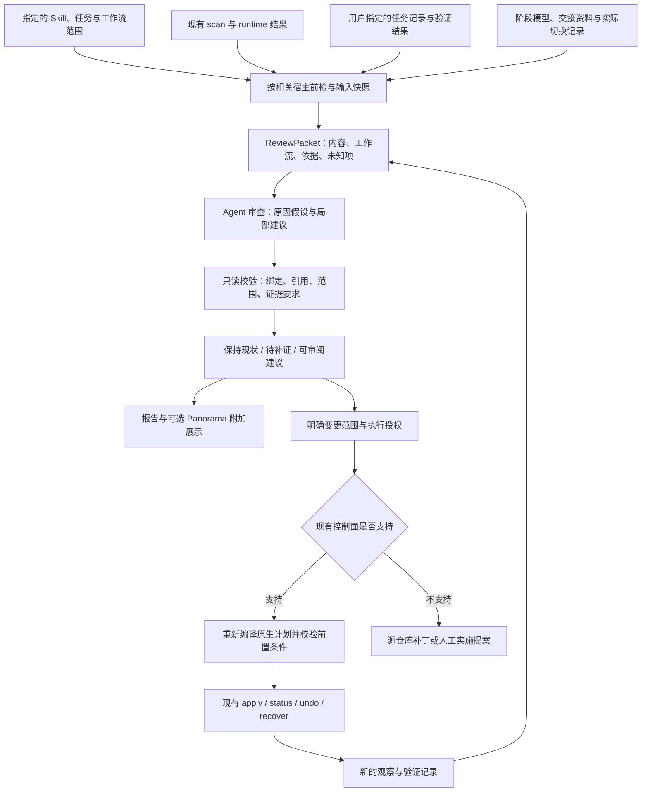

# ADR-0009：Skill 审慎演进架构优化方案

- **Status:** Proposed
- **Date:** 2026-09-08
- **Updated:** 2026-09-09：补充多模型工作流、阶段适配、交接证据与分阶段效果验收。
- **审查基线:** `2a5d8dcc47a819339baf8b1e21ce15ad8f25affe`
- **文档性质:** 架构优化提案；新增协议、接口和文件均为拟议设计，不代表已经实现或获准部署。
- **适用范围:** 任意来源、用途和宿主的 Agent Skills；证据能力与可执行操作按实际环境限定。
- **关联:** 延续 [ADR-0001](0001-non-invasive-skill-observability.md) 的观测边界、[ADR-0006](0006-declarative-managed-collections-and-reconciliation-catalog.md) 的来源与事务约束，并与 [ADR-0008](0008-runtime-aware-global-skills-management.md) 的运行时分层设计兼容。本提案不变更前述 ADR 的采纳状态。

## 1. 架构决策摘要

在现有事实收集、运行时证据和部署控制面之上，增加一个**审慎演进审查层**。它根据真实工作流中各阶段的模型、任务、工具和交接条件，将具体问题转化为有证据、有适用范围、可复查的局部调整建议；它不拥有安装、升级、隔离或删除权限。

本方案必须覆盖用户明确提出的常见使用方式：由 Astra、Fable 5.1 等高能力模型规划，由成本更低的模型执行，再由高能力模型或人验收。这里的模型名称用于说明用户场景，不代表固定的产品路由或经本仓库测量的能力排名。单模型、没有独立验收、执行中切换模型等情况同样有效，不能强制套用三个阶段。

**负责审查 Skill 的模型、负责规划任务的模型、实际执行模型和验收模型必须区分。审查者认为多余的指导，可能正是执行者可靠完成任务所需的支持。** 因此，本架构的目标是让指导适合真实使用者及其所处阶段；保留、补充、收窄和简化都只是候选手段。

一项 Skill 的价值还可能在于：把规划者的知识与判断转成可复用的执行支持，使成本较低的模型也能可靠完成工作。这种价值需要通过实际执行质量和完整交付成本验证，不能仅用最强模型是否独立完成同一任务来衡量。

核心决策如下：

1. **保持现状是正常结果。** 没有具体问题时，不为完成报告而寻找修改机会。
2. **内容价值、暴露方式、执行方式分别判断。** 低频的重要能力可以长期保留、按需提供，部分操作也可以工具化。
3. **以具体内容、任务阶段和实际执行条件为审查单位。** 一份 Skill 可以只调整规划阶段的触发条件，同时为执行阶段保留必要步骤；业务知识、验收要求和资源继续保留。
4. **每种建议有独立的证据要求。** 长度、年龄、调用次数、作者类型、模型能力宣传不能单独决定处置。
5. **机器校验证据绑定与建议边界，Agent 负责语义判断。** 校验成功不等于判断正确，更不等于已经授权执行。
6. **复用现有控制面。** 合格建议经过明确的作用范围确认后，才能转换成现有机制支持的计划；不支持的操作保留为人工或源仓库变更提案。
7. **先验证不会误伤，再扩大自动化。** 第一阶段调整审查标准与评测，第二阶段建立结构化记录，最后才接入展示和受控执行交接。
8. **不以最强模型代替真实执行者。** 简化建议必须覆盖受影响的实际执行路径；验收模型修补后的成功，不得冒充执行模型独立完成或端到端成本降低。

第一版不建设通用 Agent 平台、全量会话监控、自动退役引擎或 Skill 价值排行榜。

## 2. 当前架构与需要修正的缺口

### 2.1 已有能力及保留边界

| 已有部分 | 当前可复用能力 | 本次边界 |
|---|---|---|
| [skill-scan](../../skills/skill-hygiene/bin/skill-scan.sh) | 文件、引用、来源线索、内容身份、静态运行时阻断 | 继续收集事实，不计算价值分数 |
| [runtime evidence](../../skills/skill-hygiene/lib/runtime-evidence.mjs) 与 [adapters](../../skills/skill-hygiene/lib/runtime-adapters.mjs) | 宿主、配置、制品绑定；catalog/body/route 等证据分层 | 沿用原 schema 和结论，不把新审查结果写成原生运行证据 |
| [runtime profile](../../skills/skill-hygiene/lib/runtime-profile.mjs) | 已支持范围内的暴露计划与恢复 | 不假设所有宿主、所有 Skill 都可通过它调整 |
| [cleanup contract](../../skills/skill-hygiene/lib/cleanup-contract.mjs) 与事务实现 | 精确路径、身份、前置条件和可恢复隔离 | 语义上的退役建议不是 cleanup 输入，也不是批准 |
| [skills-refiner](../../skills/skills-refiner/SKILL.md) | 设计判断、证据纪律、集成审查 | 增加审慎判断能力，保持独立安装可用 |
| [Panorama](../../skills/skills-panorama/lib/panorama-cli.mjs) | 安装拓扑、缺口和派生展示 | 演进建议作为独立附加视图，不改变八类拓扑缺口 |

安装、catalog 可见、正文读取、遵循要求、任务收益是不同结论。原生探针主要取得 catalog 证据；`body_access` 与 `route` 在现有适配器生成结果中仍保守地设为 `unverified`。本方案不以增加字段的方式宣称补齐这些能力。

### 2.2 判断层的具体缺口

1. **部分评测偏向增加指导。** [case-08 锚点](../../evals/golden/case-08-skill-creator-audit-anchors.md) 要求至少识别三个设计问题，并倾向补充策略、边界和失败处理。这样的样本有用途，但需要与“合理保持现状”和“减少过度指导”的样本平衡。
2. **启发式可能被误读成结论。** [skill-hygiene](../../skills/skill-hygiene/SKILL.md) 中关于大文件成本、自动生成内容可丢弃的措辞，需要改成有条件的待核查项。来源与作者不能代理价值判断。
3. **输出形式可能推动过度审查。** [skills-refiner 的输出规范](../../skills/skills-refiner/SKILL.md) 固定列举优缺点、评分和多部分报告；需要允许紧凑的问题记录，以及有依据的零修改结论。
4. **缺少任务偏差与具体指导之间的记录。** 当前观测能够辅助确定是否发现或读取；尚不能仅凭这些事实判断反复确认、过度验证、范围扩张由哪条指导造成。
5. **生命周期建议缺少稳定的证据交接。** 目前的自然语言建议尚未形成可被重新验证、限制作用范围并与现有计划分离的统一记录。
6. **运行条件尚未表达为工作流。** 宿主身份和 runtime 配置绑定不能直接表达谁规划、谁执行、谁验收、交接时提供了哪些内容，以及模型切换或返工发生在哪一段。需要在新审查包中补充，不能从当前审查模型推导全流程模型。

以上是源码审查发现的设计风险，不是已经证明这些文本导致了真实任务失败。

## 3. 目标、非目标与成功标准

### 3.1 目标

- 对一般 Skill，能给出保留、待核查或局部改进建议，并明确依据。
- 对低频重要能力，不因缺少使用记录而降级或清退。
- 对过度干预，能定位候选指令、触发情境和观察到的任务偏差。
- 对指导不足，能判断执行者是否缺少必要步骤、示例、验证条件或交接资料；不将所有细化都视为负担。
- 对多模型工作流，分别评估各阶段与交接，保留执行者需要的支持，记录验收及修补的真实成本。
- 对模型升级，能找出依赖旧模型行为的假设，限定复验范围。
- 对每项变更，记录要保留的能力、待验证效果和恢复路径。
- 对无法判断的领域、缺失的轨迹、不可观测的宿主，保留未知状态并继续完成不受影响的审查。

### 3.2 非目标

- 不根据总分、低频、文件年龄、长度、名称或生成方式自动移除 Skill。
- 不把所有 Skill 改写成统一模板，也不要求上游新增私有 frontmatter 字段。
- 不推导所有模型、所有领域的普适价值结论。
- 不假设规划、执行、验收使用同一模型；不按价格、型号名称或当前审查者的能力自动选择指导版本。
- 不替代现有创建工具、宿主执行系统、来源管理、发布流程和事务恢复。
- 不自动读取全部历史会话，不注入或移除 canary，不默认发起付费模型实验。
- 不把目录嵌套、移动文件或缩短 Markdown 字数当作已经获得上下文收益。

### 3.3 成功标准

成功以“建议是否适合实际工作流、修改是否必要、原有能力是否得到保留、完整交付代价是否可接受”衡量。审查覆盖率、发现数、修改数和删除数不作为优化目标。

同时约束两类错误：

- **误伤:** 把合理复杂度、必要约束、低频知识，以及实际执行者所需的详细指导判成负担。
- **漏报:** 面对明确的反复阻塞、失效命令、指导不足或交接遗漏，仍以谨慎为由不指出问题。

## 4. 目标架构



图中 `C/D/E/F` 是新增的逻辑能力，不分别建立服务、进程或数据库。首版由现有审查 Skill、一个结构化记录协议和一个只读校验工具承载。

### 4.1 依赖方向

- 审查层消费现有事实，不反向修改 scanner、runtime status 或 collection catalog。
- 现有控制面不导入 LLM 判断代码；审查记录不能作为可执行计划反序列化。
- Panorama 只读取已经过格式与新鲜度检查的摘要；缺少审查记录不影响原有拓扑功能。
- `skills-refiner` 单独安装时，仍可审查显式提供的 Skill；缺少其他工具的结果标为未知，不强制安装整套治理工具。
- 不从带本机文件系统副作用的控制面模块导入审查纯函数。身份与摘要格式保持兼容，但不为复用几个函数引入运行时耦合。

### 4.2 三种输入模式

| 模式 | 最小输入 | 可以得出什么 | 不可以得出什么 |
|---|---|---|---|
| 内容审查 | Skill 内容、资源、可确定的作用范围 | 静态问题、规则冲突候选、保留理由、验证建议 | 已经造成实际行为损失 |
| 事件审查 | 内容快照、指定任务记录、有效指令上下文 | 某个偏差与指导的关联，以及其他可能原因 | 仅凭一次关联证明普遍因果 |
| 变更验证 | 原版与候选、固定任务与环境、可复核结果 | 在明确范围内支持或反对该修改 | 对未覆盖任务或其他模型全面外推 |

不强制每次审查依次跑完三种模式。可由内容审查直接报告文件失效，也可在没有问题时结束。

### 4.3 先识别真实使用场景

审查前先从已授权的任务输入、运行记录、计划交付物和配置中确定工作流，不先要求用户填一张全量模型调查表：

1. 确认待调整内容在哪个阶段被谁读取或执行。审查者自身不自动算作该 Skill 的目标用户。
2. 分别记录用户声明的使用方式、配置中的预期路由、实际运行记录。三者不一致时并列报告；声明不能冒充实测，单次实际运行也不能抹掉其他已声明的部署需求。
3. 记录相关阶段的模型、effort、宿主、可用工具、权限与实际得到的资料；无法观察的值保留未知。
4. 确认计划或交接是否已经承载了一部分 Skill 指导。正文未在执行阶段读取，不等于它没有通过计划发挥作用。
5. 确认备用模型、返工回路、人工接管和无独立验收路径是否属于本次拟变更范围。没有证据就不宣称覆盖，也不自动扩展审查范围。

例如，同一部署 Skill 中，规划者可能只需要约束和决策依据，执行者需要准确命令、前置条件与失败处理，验收者需要通过标准和结果证据。具体内容是否需要调整，由该工作流的记录与验证决定，不按“强模型用简版、弱模型用详版”的标签自动套用。

如果执行模型未知，可以继续做来源、引用和静态冲突审查；但不能把只在规划模型验证过的简化推广到所有执行者。只阻断依赖缺失信息的推广结论，不阻断整个审查。

## 5. 核心审查模型

### 5.1 身份、版本与段落定位

审查对象必须同时保留内容身份和观察位置：

- 有来源证明时：repository、immutable revision、source path、declared name、内容摘要。
- 只有本地内容时：规范路径、原始文件摘要、资源摘要、`provenance=unverified`；不补造 repository 或 revision。
- 段落定位：文件路径、行号范围、原文片段摘要。行号用于阅读，文件与片段摘要用于检测漂移。
- 安装路径、软链目标和宿主是部署证据，不取代内容身份。

原始摘要用于确认具体字节；现有 `normalized_content_sha256` 可用于内容关联，但不能替代补丁应用前的原始字节校验。归一化比较不会修改任何 canary 或源文件。

### 5.2 “为什么存在”作为待核实主张

对与当前问题相关的内容，记录以下结构；不要求批量标注所有段落。

| 字段 | 含义 |
|---|---|
| `purpose` | 它提供什么资料、要求、工具能力，或避免什么具体失败 |
| `applies_when` | 适用任务与前提；未知时明示 |
| `basis` | 原文说明、权威资料、历史事故、测试，或审查者推断 |
| `must_preserve` | 修改时仍然必须存在的知识、约束、结果或恢复能力 |
| `depends_on` | 相关系统、工具、规则、宿主或模型条件 |
| `recheck_when` | 哪个依赖变化后需要重新判断 |

“业务知识”“组织约束”“工具资源”“模型行为补偿”只是检索与复验线索，可以重叠。分类本身不产生处置建议。

模型能独立生成某项知识，不等于它知道当前有效的内部规范；脚本可以重写，不等于已有脚本可以删除；一条规则解释不清，也只意味着存在理由未知。

### 5.3 观察、推断与因果分开

每项 finding 的证据关系使用明确枚举：

- `static`: 直接从内容或本地结构确定的事实。
- `reported`: 用户报告的现象，尚未由任务记录复核。
- `associated`: 记录显示相关内容被读取，且发生对应偏差；尚有其他解释。
- `comparative`: 有受控变更或对照证据，支持限定范围内的影响判断。

这些标签不构成自动升级阶梯。多个 `reported` 不会自动变成 `comparative`；一次成功也不能把整份 Skill 标为有效。

合法 finding 还应列出 `alternative_explanations`。例如：宿主权限阻断、用户确实未授权、工具失败、其他指令要求、任务信息不足。无法排除时限制结论，不编造置信百分比。

对于分阶段任务，还须考虑计划缺项、交接内容被压缩、执行模型未读取参考资料，以及验收者实质重做。成功或失败必须关联到实际产物和阶段，不能只看最后一条完成消息。

### 5.4 运行时前检仍为第一道检查

- 首先核验 frontmatter、name/description、长度、显式本地引用和已知 loader 要求。
- `fail` 表示有已证实阻断；优先指出，禁止宣称该目标在该宿主运行通过。
- `unknown` 不阻止内容审查；禁止将无静态阻断升级为运行通过。
- 宿主启动失败、认证失败或不支持原生探针单独记录，不归咎于 Skill。
- 即使存在运行时故障，也可继续形成静态修复提案；行为收益验证必须等待相关执行路径可用。
- 多宿主工作流按受影响的宿主分别前检。规划宿主可加载，不证明执行宿主可以加载；只接收计划而不直接加载 Skill 的阶段，标明消费方式并核查实际收到的交接内容。

### 5.5 阶段适配与交接内容

首选保留单一来源，在必要时按任务阶段组织参考内容，并保持共同约束和验收标准一致。只有证据表明读取和使用方式需要区分，才提出阶段性暴露或条件化指导；不为每个模型复制一套 Skill。

交接中需要可核对的内容包括：任务目标、已作决定、适用边界、必要步骤或资源入口、验收标准、未解决问题和当前完成状态。只记录与本任务相关的项目；不得假定执行者继承规划者完整对话或内部推理。

以下两种错误必须对称防范：

- 高能力规划者觉得步骤显然，删掉后执行者无法可靠完成。
- 因为执行者成本低，就无条件增加大量指导，反而造成干扰或加载负担。

如果宿主无法可靠识别阶段、无法选择对应内容，或者执行者能否按需找到资料尚未验证，就保留原有入口和必要指导。阶段适配不以增加复杂路由器为前提，也不能让模型根据自我评价自行绕过关键约束。

## 6. 处置模型与证据要求

### 6.1 六种处置不是互斥状态机

建议以操作列表表达，并分别描述内容、暴露、执行和可用性变化。每项操作绑定具体段落、文件或部署位置，以及适用的工作流和阶段；在重叠作用范围内互相矛盾的操作必须由校验器拒绝。不同阶段可以有不同暴露建议，但同一个共享文件的源补丁仍需合并校验，不能生成彼此不兼容的字节修改。

| `operation` | 含义 | 最低审查依据 | 特殊约束 |
|---|---|---|---|
| `retain` | 保持当前内容及相应状态 | 明确范围；说明存在理由或暂无变更依据 | “维持现状”与“价值已验证”分别表述；不自动恢复被隔离项 |
| `restrict_trigger` | 缩小触发条件 | 可指出应触发与不应触发的情境 | 迁移前验证应触发任务仍被覆盖；不等同于删除目录投影 |
| `reference_on_demand` | 保留内容，延后读取 | 有可用检索入口，明确读取时机 | 必须提前知道的边界仍在入口；证明路径可达不等于证明任务中能找到 |
| `delegate_to_tool` | 将确定部分交由工具实现 | 输入、结果、失败条件与现有依赖明确 | 工具实现完成且验证后才能撤下被替代部分；保留适用范围与异常指导 |
| `quarantine` | 暂停特定安装或暴露位置 | 有具体故障或风险，并明确影响与恢复条件 | 静态风险关键词只产生待审项，不单独触发隔离 |
| `retire` | 在指定范围停止依赖该能力 | 需求消失的依据，或替代能力及依赖覆盖证明 | 不是全局销毁源资产；部署移除仍通过可逆的既有机制 |

内容变更另用 `revise_guidance` 表达，允许局部补充、澄清、删除重复或压缩措辞。它是编辑操作，不增加第七种生命周期状态。建议必须说明目标阶段存在的指导不足或多余干预、需要保留的共同约束，以及原版与候选的验证范围；不能用 `retain` 暗中夹带正文修改，也不能把所有修订都编码成简化。

`retain` 的理由使用 `supported_value` 或 `insufficient_change_basis`。两者在报告中必须区别显示，不能都算“价值验证通过”。

任何操作均可先作为 `candidate` 提出，并附待验证条件。满足内容与范围审查要求后进入 `reviewable`；它仍不代表已经取得操作授权、完成候选验证或获准部署。

### 6.2 不得单独推出处置的信号

以下信号只能缩小调查范围：低频、零 canary、mtime 较旧、正文很长、自动生成、多个相似名称、模型声称自己会做、公开榜单分数提高。

证据不足时输出缺失项及现状，不把全部不确定性转换为让用户逐项回答的问卷。只有缺失信息直接影响当前必要决定时，才提出具体问题。

### 6.3 低频重要能力

检查“被保护对象仍存在、故障场景仍有依据、后果值得防范、现有内容仍能支持处理”。不要求出现真实事故后才能判断，也不根据标题中的“关键”“恢复”授予永久豁免。

有效的验证可以是历史案例重放、隔离演练、命令与资源校验。演练覆盖范围与真实使用分别记录。若没有适用任务或观测覆盖不足，使用频率字段为未知，不填写有效率为零。

过时恢复指南应优先明确失效点并修复；原有经验可以保留，危险执行入口可以单独隔离。

### 6.4 互相替代与组合影响

当 A、B 两项指导互相覆盖，分别去掉 A 或 B 都没有影响，不足以支持同时去掉两者。替代关系必须保存到建议依赖中；候选组合还需验证剩余能力覆盖。

内容修订、暴露变化与工具化可组成一组候选，但首版不实现跨源仓库与本机配置的分布式事务。必须给出顺序：先发布并验证替代能力，再调整旧入口，最后考虑撤出旧内容；中断时优先保留可用前任。

### 6.5 建议只在经过核对的工作流范围内成立

- 规划模型不需要某段步骤，只能支持调整其规划阶段的使用方式；不能据此移除执行者所需内容。
- 执行者没有读取 Skill，但计划已经包含其中关键步骤时，应将这些步骤视为间接使用的内容，不能按零正文读取认定冗余。
- 验收者修复了执行错误，说明整个流程完成了修复；不能据此认为简化后的 Skill 对执行者没有负面影响。
- 某条执行路径可以简化，不代表备用模型、低 effort 或人工交接路径也可以简化。建议声明支持与未覆盖的路径，不使用隐含的全局作用域。
- 若改善仅能通过更换为高成本执行模型获得，应标为工作流配置变更或组合变更，分别报告能力与成本，不能单独归功于 Skill 优化。

示例结论：保留部署步骤作为执行资料；规划阶段减少重复展开；验收阶段保留关键通过条件。只有当前目标宿主能够提供对应内容、交接与实际执行路径均经验证时，才调整暴露。该结论不要求拆成三份独立 Skill。

## 7. 数据协议与校验接口

### 7.1 首版只增加一个审查包协议

拟议 schema：`skills-refiner.evolution-review.v1`。一个包可以包含多个目标，但每个目标独立记录结果，不以批次平均值掩盖未知或失败。

| 顶层字段 | 必填 | 内容与约束 |
|---|---|---|
| `schema_version` | 是 | 精确版本；未知 major 拒绝 |
| `review_id` | 是 | 规范化包内容摘要，计算时排除本字段 |
| `created_at` | 是 | 生成时间，不冒充观察时间 |
| `producer` | 是 | 产生本审查包的工具与模型；与任务的规划、执行、验收者分开；未知可空 |
| `scope` | 是 | 目标集合、任务类别、工作区或输入范围、工作流与宿主适用范围及明确排除项 |
| `workflow_context` | 是 | `coverage=known / partial / unknown` 与 `profiles`；内容审查可为空列表并标记未知，不猜测执行者 |
| `subjects` | 是 | 内容身份、观察路径、资源与段落绑定 |
| `preflight` | 是 | 各目标运行时前检结果与来源；未知可保留 |
| `evidence` | 是 | 证据引用、观察时间、摘要、来源类型、覆盖范围、局限；可为空但不得支撑实证结论 |
| `findings` | 是 | 事实、原因假设、证据关系、其他解释；允许空列表 |
| `recommendations` | 是 | 操作、理由、保留项、验证条件、目标范围和依赖；允许保持现状 |
| `limitations` | 是 | 未覆盖任务、缺失记录、无法确定的权威或运行条件 |

证据来源类型至少区分 `filesystem`、`native_runtime`、`user_report`、`task_transcript`、`authority_document`、`experiment`。来源声明仍需核查；用户提供的 JSON 不能仅凭自称 `native_runtime` 获得原生等级。

每个 workflow profile 包含 `id`、`basis_refs`、`declared_paths`、`stages` 和 `handoffs`。`stages` 是实际有关阶段的列表，不强制恰好三项；同一角色可反复出现，单模型也可承担多个角色。

| 阶段或交接字段 | 语义 |
|---|---|
| `stage_id`、`role` | 本流程内身份与职责，如 `plan / execute / verify / repair`；职责来自任务或记录 |
| `actor_kind` | `model / human / tool / unknown`；不把人工验收省略为已自动通过 |
| `declared_runtime`、`observed_runs` | 分别保存声明配置和实际调用；模型标识、effort、宿主、工具权限、来源引用可未知；同一阶段内发生切换则分别记录运行 |
| `input_refs`、`output_refs` | 实际传入资料和阶段产物摘要；接收方的输入用于验证交接，不只看发送方声称已经提供 |
| `skill_consumption` | `direct / via_handoff / not_observed / unknown` 及证据引用；`via_handoff` 需关联具体传递片段，仅语义相似时仍是推断 |
| `handoffs` | `from_stage`、`to_stage`、输入输出证据、传递或缺失的约束与资源；不保存或要求模型隐含推理 |

不同来源的配置不压成单个“当前模型”。验收模型同时修改产物时，新增 `repair` 阶段或运行记录，保留修改前产物。Fallback 路径通过 `declared_paths` 显式列出；不知道时保留未知，不自动补成最强模型。

不将本协议插入已有 runtime evidence、cleanup review 或 collection schema。需要关联时保留原记录 ID 与摘要。

### 7.2 建议记录

每项 recommendation 包含：

- `id`、`operation`、`targets`、`task_scope`；
- `applicability`：明确的 workflow/stage 引用、运行条件、排除路径，以及条件无法确认时如何保持当前有效行为；静态通用问题须说明为何不依赖具体模型；
- `reason`、`evidence_refs`、`finding_refs`；
- `must_preserve`、`expected_effect`、`possible_regressions`；
- `verification_requirements`：每项为 `required / satisfied / not_applicable`，满足项引用结果证据；
- `dependencies`：内容、工具、来源文档、配置、替代能力、各阶段模型条件与交接产物中实际影响结论的项目；
- `delivery_kind`：`none / source_patch / runtime_profile / cleanup / manual`；
- `restore_strategy`：保持现状时为 `not_applicable`；其他情形说明可行的恢复方式及边界。

这里不包含 `approved=true`、可执行 shell 文本或可被控制面直接消费的 plan。批准和精确计划由现有执行过程持有。

### 7.3 拟议代码接口

首版新增一个小型契约模块及一个只读入口；以下是未来实现接口，不是当前可调用 API。

```typescript
validateReviewPacket(input: unknown): ReviewPacket
// 格式、类型、ID 唯一性、阶段与交接引用、操作冲突、限制大小。

checkRecommendations(packet: ReviewPacket, observed: ObservedBindings): ValidationResult
// 检查证据绑定、当前性、建议覆盖的执行路径及所需材料；不进行文件写入或 LLM 调用。
```

`ObservedBindings` 由入口根据用户显式提供的路径重新读取并计算。不得使用审查包自带摘要作为“重新观察”的结果。

`ValidationResult` 使用独立 schema `skills-refiner.evolution-validation.v1`，包含 `review_id`、`checked_at`、`subjects`、`recommendations`、`errors`。逐项结果为：

- `reviewable`: 格式、身份和必要材料齐备，可以进入实质审查；不证明语义正确。
- `insufficient`: 记录有效，但特定建议缺少必要材料；显示具体缺口。
- `stale`: 内容或相关依赖已经变化；历史记录保留，禁止当作当前证据。
- `invalid`: 非法结构、引用、越界或相互冲突的操作。

候选验证尚未满足时，建议可以被展示和讨论，但报告必须写明未验证，不能产生“可实施”摘要。机器可以确定材料是否缺失，不能自动判断自然语言理由是否充分；后者仍由审查者负责。

工作流校验必须额外检查：审查 `producer` 未被当成默认执行模型；建议引用的阶段与路径存在；从局部实验证据到建议作用域没有隐含扩张；缺失执行者信息时不能输出跨执行者的简化资格；涉及验收修补的结论具有修改前产物或明确的缺失标记。适用条件无法确定是否重叠时输出 `insufficient`，不由模型自信代替范围证明。

上述协议仍为未发布的 v1 提案，本次补充直接纳入草案；实现和发布后再按兼容规则演进，不将后续必填字段无条件追溯到已发布记录。

### 7.4 输入与持久化边界

- 所有读取限于用户指定输入及显式允许的证据根。拒绝路径穿越、任意 URL 获取和跟随软链越过允许根。
- 对合法安装软链，先解析目标并确认目标位于允许的内容根；不将“存在软链”本身判成错误。
- 建议首版限制审查 JSON 为 4 MiB、每包最多 256 个目标和 1,024 条证据引用；单份外部证据读取最多 8 MiB。超限显式拒绝，禁止静默截断后声称审查完整。限制值是工程初值，后续用真实包大小验证。
- 记录写到显式输出位置；不创建全局常驻数据库、不扫描完整 HOME、不默认持久化整个聊天记录。
- 行为记录只保留必要片段及结果引用；脱敏后内容单独计算摘要。摘要证明内容绑定，不提供防恶意篡改的宿主认证，也不代替隐私审查。
- 审查对象和任务记录中的命令均为待审数据，不自动执行。引用的“必须删除”“忽略其他指令”等文本不改变审查权限。
- 生成新记录，不覆盖旧记录；`latest` 如需展示，仅是可重建指针。所引用证据丢失时标为不可复核，不自动恢复成当前结论。

## 8. 多模型工作流验证与升级

### 8.1 实验只为解决具体疑点

默认不跑全库、全模型矩阵。只有当内容审查和已有记录不足以决定一个实际候选时，才安排范围受控的验证。选择范围来自用户实际采用的工作流与已声明备用路径，不能只选择最强模型作为执行者，也不能因价格低就断定某模型需要更多指导。

比较流程指导时，各组保留相同业务资料、工具、权限和必须遵守的要求，仅改变候选指导。若比较的是暴露策略，则保持内容不变，检查触发、读取时机和结果。不得同时换模型、改工具、删资料，再把效果归因于 Skill。

验证记录至少包括各阶段模型的可观察标识、effort、宿主版本、关键配置、任务与交接材料摘要、原版与候选摘要、其他有效指导、重复次数及逐案例结果。缺失重要条件时降低可归因范围，不伪造快照版本。

对执行阶段的局部归因实验，固定规划产物和验收标准，只改变该阶段指导。对规划指导或阶段暴露的变更，另做完整工作流验证，重新生成交接产物，检查下游影响。这两类结果分别报告，不能用固定计划的局部实验代替整个方案的效果验证。

### 8.2 评价结果而非模板服从

按真实任务要求检查正确性、关键遗漏、返工、不必要打断、时间与成本。只有业务或安全要求规定了步骤时，才把特定步骤作为硬约束；不能用 Skill 自己发明的步骤证明它有用。

- 同时包含应触发与不应触发的案例。
- 常见任务与低频关键案例分别报告。
- 使用重复运行与未参与修改的保留案例；一次无差异不等于已经证明等价。
- 原始结果、评分规则和争议记录可复核；评分模型的自信不构成证据。
- 必要时采用盲评或领域复核；缺少领域依据时明确未验证，不让通用模型自证所有领域结论。
- 验收时先冻结执行者产物并记录判断，再允许修复或退回；修复产生新的产物摘要和运行记录。不能用修复后的文件覆盖执行阶段的评价对象。
- 单模型评测与多模型工作流评测分别报告。对“规划者能省略、执行者仍需要”的指导，允许按阶段保留不同用法。

### 8.3 按依赖复验

| 变化 | 失效或需复验的结论 | 不应顺带作废的事实 |
|---|---|---|
| Skill 或资源字节变化 | 对应内容与建议绑定 | 历史记录本身 |
| 宿主发现配置变化 | 相关 catalog、暴露与行为结论 | 未改变的上游内容身份 |
| 某阶段模型或 effort 变化 | 该阶段及依赖其产物的下游行为结论；必要时复验相关完整路径 | 组织规范的权威性、文件是否存在 |
| 规划或交接资料变化 | 依赖这些资料的执行与验收结论 | 无关工作流和未改变的源文件身份 |
| 验收者、修补策略或备用路由变化 | 相关路径的最终质量、修补成本和可靠性结论 | 不依赖该变化的静态事实 |
| 工具接口变化 | 调用、恢复与工具替代验证 | 不依赖该接口的业务知识 |
| 组织规则或系统变化 | 相关存在理由和验收标准 | 无关 Skill 的结论 |
| 替代能力被移除或修改 | 依赖它的收窄、按需或退役建议 | 其他独立建议 |

不依赖周期定时任务实现首版复验；每次读取建议时检查可确定的依赖。时间窗口只限制观察有效期，不用于证明内容过时。

### 8.4 完整工作流的质量与代价

下面四个观察点必须分开；角色可以由模型或人承担，不要求额外部署四个 Agent：

| 观察点 | 保存的证据 | 能回答的问题 |
|---|---|---|
| 规划交付 | 计划、约束、执行入口和验收标准 | 执行者实际获得了什么，是否缺少必要信息 |
| 执行交付 | 验收修改前的产物、错误、检查结果和耗时 | 执行者在这些条件下完成到了什么程度 |
| 验收判断 | 针对被冻结产物的发现、通过或退回依据 | 是否发现关键遗漏；验收不能仅凭模型评分自证正确 |
| 修补与最终交付 | 每次修补的责任者、变更、成本和最终验证 | 最终成功由谁补足，整个流程付出了多少代价 |

至少分别报告执行阶段首次交付质量、返工或接管次数、关键问题、最终交付质量，以及规划/执行/验收/修补的成本。总成本包括重试和必要工具调用；可观察的人工作业成本单列，未知项不按零计算。耗时按真实工作流记录，不能把并行阶段时间简单相加当作用户等待时间。

“执行者首次交付退化”不自动等同于整个工作流不可用，但不能被最终通过隐藏。接受这种权衡需要关键质量底线仍成立、修补路径经过验证、完整成本与延迟符合任务约束，并明确说明变化。默认不为追求少写指导而增加对最强模型的隐性依赖。

对于拟在多条路径使用的同一个候选，逐路径列出 `validated / unverified / regressed` 及证据。全局替换需覆盖此次声明受影响的路径；只覆盖部分时，限制适用范围或保留现有版本，不要求遍历所有市场模型。

### 8.5 模型专属建议的使用边界

[Fable 5.1 官方提示指南](https://platform.claude.com/docs/en/build-with-claude/prompt-engineering/prompting-claude-fable-5-1) 指出，既有 Fable 5 提示通常无需更改，应按观察到的差异调整；effort 名称不能跨模型等量比较，低 effort 下检索行为也可能不同。这些信息用于提出有范围的检查假设，不作为简化或细化其他执行模型 Skills 的依据。

模型文档只描述特定模型与接口。采纳其建议时，记录目标阶段、实际型号与配置、宿主支持情况，并核对具体症状。若问题来自 UI 未展示进度、工具未提供、交接丢失或宿主不支持某 API，优先定位该层，不能将其都归为 Skill 文本问题。

任何阶段适配都沿用实际宿主支持的上下文与配置方式；不把 API 层的能力假设成所有桌面或 CLI 宿主可用，也不通过随意重写运行中历史来实现动态切换。

## 9. 与现有代码的最小整合

### 9.1 文件级改动规划

下列新增路径均为拟议文件；本 ADR 交付不创建实现代码。

| 文件 | 计划改动 | 阶段 |
|---|---|---|
| `skills/skills-refiner/SKILL.md` | 增加实际工作流识别与审慎演进入口；区分审查者和执行者；允许零修改结论 | A |
| `skills/skill-hygiene/SKILL.md` | 修正长度、年龄、作者与价值之间的暗示，保留真实故障优先级 | A |
| `skills/skills-refiner/references/conservative-evolution.md`（新增） | 存放阶段适配、交接、处置证据要求及复验方法，按需读取 | A |
| `evals/rubric.md`、相关 case/golden | 奖励按实际执行路径保留、补充或局部简化；消除问题数量门槛 | A |
| `skills/skills-refiner/lib/review-contract.mjs`（新增） | 含 workflow_context 的审查包、纯校验、路径作用域和依赖检查 | B |
| `skills/skills-refiner/bin/review-check.mjs`（新增） | 显式输入读取、重新计算摘要、只读输出；不执行建议 | B |
| `skills/skills-refiner/tests/test-review-contract.mjs`（新增） | 校验真实协议逻辑、边界、冲突与失效 | B |
| `skills/skills-refiner/tests/test-review-check.mjs`（新增） | 临时目录中的真实入口、路径与零突变验证 | B |
| `skills/skills-panorama/lib/panorama-cli.mjs`、`panorama-collect.mjs`、`panorama-render.mjs` | 可选导入校验后审查摘要；无审查输入时保持原行为 | C |
| `skills/skill-debug/tests/test-install-layout.sh` | 验证新增随包资源及独立安装布局 | B/C |

新增校验工具拟使用 Node.js 24 和标准库，与现有控制工具的运行基线一致，不增加第三方依赖。设计审查本身仍不要求 Node；仅运行新机器校验入口时需要该运行时。

为避免意外耦合，第一版不向 `skills-refiner` 现有控制 launcher 增加一个可以隐式进入写操作的综合命令。只读入口独立，命名清楚标示检查用途。

### 9.2 Panorama 展示约束

建议结果与拓扑健康分栏：某 Skill 可以拓扑正常、行为待核查；也可以链接损坏、知识仍值得保留。禁止用单一红黄绿覆盖这两个判断。

每行最多展示建议、理由摘要、适用工作流或阶段、证据范围、是否过期和详情入口。没有审查结果显示“未审查”，不是“无价值”；保持现状时区分已知价值与暂无修改依据。不同阶段结论不合并成单一“该 Skill 应简化”。

原有 JSON 如果采用严格 schema，新增字段必须通过显式版本演进提供；不得让旧消费者把陌生字段误读为原有状态。首版可先仅在独立附加报告展示，避免不必要的协议升级。

### 9.3 执行交接边界

- 调整正文或 description：生成源仓库补丁，经源仓库验证与发布形成新制品；不覆盖第三方安装副本。
- 调整宿主暴露：只有该宿主和目标受现有 runtime profile 支持时，才能转换为相应计划。
- 隔离或退役本地条目：只有符合既有 cleanup 资格的精确路径才能进入现有 review/plan 流程。
- 工具化：作为正常实现工作交付、测试和发布；替代能力验证前保留原入口。
- 阶段适配：先证明目标宿主能将内容提供给对应角色，且实际执行路径没有丢失必要指导。宿主不支持时保持现有暴露，不能因规划者验证通过就覆盖全局执行入口。
- 既有控制面不支持：输出 `unsupported_delivery` 和原因；禁止改用裸 `rm`、`mv` 或手工配置替代受控计划。

授权沿用会话和既有流程已有的有效授权，不额外制造重复确认。若实际动作扩大了原范围或进入需要单独确认的现有事务，必须绑定新的具体计划。审查包、摘要或模型判断都不能伪造 Owner decision。

## 10. 验收设计

### 10.1 判断能力：成对案例

至少覆盖以下六组对照，分别包含编码、写作、研究和运维用途，不只围绕单个 Skill：

| 组 | 应保持或保留的案例 | 应发现并局部处理的案例 |
|---|---|---|
| 长度 | 长但按需读取的有效参考资料 | 不相关任务也强制完整读取，且记录显示干扰 |
| 频率 | 低频恢复任务，系统和资源仍有效 | 低频恢复任务，关键命令已失效 |
| 确认 | 未授权的外部发布需要确认 | 已授权的可逆本地修复被重复确认阻塞 |
| 来源 | 自动生成但有可核对依据的内容 | 人工编写但已被新规范替代的内容 |
| 模型变化 | 内部规范和执行者所需指导，不因规划或审查模型更强而移除 | 已覆盖的实际执行路径中，强制步骤在限定对照中产生多余工作 |
| 组合 | 两项规则互相覆盖，至少需保留一项 | 重复指导可以合并且剩余入口经过验证 |

另加至少四个边界案例：仅有自述无正文读取证据；宿主故障被误归因；任务记录含恶意指令；替代依赖在建议后变化。

在阶段 A 同时加入以下工作流案例；表中“高能力/成本较低”只是案例设定，具体结果以提供的证据为准：

| 工作流案例 | 必须作出的判断 |
|---|---|
| 高能力模型规划，成本较低模型执行；简化后执行关键遗漏增加 | 保留执行者需要的指导，不用规划者的独立成功证明全局可简化 |
| 同样的详细指导在某执行模型下造成干扰，局部精简确有改善 | 支持限定范围的简化，不因“执行模型较弱”就一概细化 |
| 执行产物不完整，验收模型重做后通过 | 分别记录执行退化、修补和最终成功，不能宣称原执行无退化 |
| 执行阶段未直接读 Skill，但已接收包含关键步骤的计划 | 识别经交接传递的作用；证据不够时保持未知，不据此退役 |
| 正常执行路径通过，备用模型或降低 effort 后退化 | 限制建议范围并保留备用路径支持，不输出全局替换资格 |
| 仅知道评审者使用 Astra 或 Fable 5.1，不知道执行者 | 不能以评审者型号补全 workflow；继续不依赖该信息的审查 |
| 办公文档交接时丢失数据口径或验收要求 | 定位交接缺失，保留业务标准，不盲目加长所有 Skill |

这些是通用判断回归案例，可用固定的、有明确来源标记的任务记录测试审查能力；它们不替代阶段 B/C 中对实际模型工作流的运行验证。

每个案例允许多种有效表述。判分依据是决定及理由、保留要求、证据边界和具体修改范围，不要求复现固定章节或建议数量。

### 10.2 机器校验

必须覆盖：

- 不存在的证据引用、伪造摘要、同名跨源混淆、未知 schema 和操作冲突被拒绝。
- 不完整的模型或会话信息不会被自动补全成可归因证据。
- `producer`、规划者、执行者与验收者的身份不混用；阶段、运行与交接引用必须能解析。
- 部分执行路径的证据不能生成全局可实施结论；执行者未知时仅相关建议降为 `insufficient`。
- 仅最终修补产物不能证明执行阶段首次交付质量；缺少中间产物明确标记。
- 声明配置与实际 fallback 不一致时保存两者；后续路由变化使依赖该路径的结论过期。
- 旧建议在目标或必要依赖变化后变为 `stale`，不修改旧记录。
- 合法保持现状与缺证据的修改建议分别返回正常保留和 `insufficient`。
- 路径逃逸、越界软链、超限文件、无效编码与重复 ID 显式失败。
- 入口读取期间检测到身份或摘要变化时，不输出当前绑定通过。
- 所有只读检查不改 Skill、配置、catalog、receipt 或控制面状态。
- 将建议直接传给现有 apply 接口不能绕过原协议和确认要求。

### 10.3 交付门禁

| Gate | 通过标准 | 不足时处理 |
|---|---|---|
| G0 可加载性 | frontmatter、name/description、长度、引用检查；受影响阶段的宿主与交接消费方式如实报告 | 首先报告阻断；静态审查可继续，不能宣称运行通过 |
| G1 判断校准 | 成对及多模型工作流案例能区分保留、必要细化与局部简化；误用审查者能力、掩盖修补和越权推广均为失败 | 修正指导与锚点，不能以平均分抵消 |
| G2 协议与只读性 | 契约、边界、漂移、真实入口及无突变检查通过 | 停止机器结果接入 |
| G3 候选效果 | 受影响的实际执行路径与完整工作流满足验收；关键底线成立，首次交付、修补和总成本分开；报告未覆盖路径 | 保留原版或缩小候选范围；不得用验收修补隐去执行退化 |
| G4 安装与发布 | 源码与安装制品核对、独立安装、相关宿主前检；现有协议回归通过 | 仅报告仓库候选，不宣称全局发布 |
| G5 受控执行 | 原有计划资格、授权、前置条件、恢复与事后验证成立 | 不执行，输出具体缺口或不支持项 |

G1 的严重错误案例要求零容忍；其余质量结果逐案例公开，不先发明一个跨领域总分阈值。原版与候选使用同一批输入比较，保留模型标识、次数和分歧记录。一次评测通过只证明该验收集表现。

## 11. 分阶段实施与回滚

### 阶段 A：纠正审查标准

- 修改审查入口、启发式措辞和评分标准；增加工作流识别、成对案例、多模型交接案例及按需参考。
- 不修改部署机制、宿主配置和安装目录。
- 交付物：可审阅的正文 diff、案例与锚点、原版/候选的逐案例评测记录。
- 完成条件：G0、G1；其中运行验证做不到时，明确候选状态，不声称新 Skill 已在目标宿主通过。
- 回滚：恢复先前源版本；若后续已发布，则按现有安装更新方式恢复先前制品，不覆盖未知本地改动。

### 阶段 B：建立可复核审查包

- 实现包含阶段与交接记录的单包协议、只读校验器与最小任务记录输入；不内置模型供应商调用。
- 内容审查可独立使用；轨迹输入可选；没有授权或运行条件时不发起外部实验。
- 交付物：协议、真实输入输出样例、契约和入口测试、限制说明。
- 完成条件：G0、G1、G2；至少有内容审查与事件审查两类可重放记录，其中一例覆盖规划、执行、验收或修补之间的交接。
- 回滚：移除新入口的使用，不迁移或破坏原控制面记录；旧审查包保留为历史资料。

### 阶段 C：展示与计划交接

- 将审查摘要作为可选输入接入 Panorama；明确新鲜度和适用范围。
- 对现有机制支持的操作提供交接说明和原生计划引用；不增加自动 apply。
- 交付物：附加视图、兼容性证明、一个受支持操作的计划/恢复验证，以及不支持路径的负例。
- 完成条件：G2、G4；实际实施的候选另需 G3、G5。
- 回滚：关闭附加输入，保持原拓扑显示；已执行操作由原控制面 undo/recover 负责。

### 阶段 D：有证据地扩展

只有前述阶段能稳定减少误判，才考虑增加宿主原生轨迹适配、更多任务验证或相关依赖变化提示。多模型工作流识别属于 A/B 的基础要求，不推迟到此阶段；此处只扩展证据覆盖和自动化程度。每次扩展独立声明能力与限制，不默认引入后台监控和全库重评。

建议分批提交：A 的指导与评测；B 的协议与校验；C 的可选展示与交接。每批保持可独立审查、验证和回退。

## 12. 关键取舍

| 方案 | 判断 | 原因 |
|---|---|---|
| 全库打分并自动淘汰 | 不采用 | 使用机会、关键程度、上下文成本不可压成一个可靠总分 |
| 只增加一段“请谨慎”的提示 | 不足 | 不改变评测倾向，也无法追踪建议所依赖的内容 |
| 一开始建设全量遥测和跨模型实验平台 | 暂不采用 | 成本高、隐私面大，尚未证明能解决当前误判 |
| 通过关键字自动发现并修复强制语句 | 不采用 | 必要的安全约束和多余干预可能使用相同措辞 |
| 用最强模型的表现决定所有 Skill 的粒度 | 不采用 | 规划、执行和验收的需求不同，可能移除实际执行者所需支持 |
| 每个模型维护一份独立 Skill | 默认不采用 | 容易产生内容漂移；优先单一来源、必要的阶段适配和明确的适用范围 |
| 小型审查协议、按需证据、局部候选 | 采用 | 能嵌入现有架构，先约束判断与变更范围，再逐步增加自动化 |
| 在每份第三方 Skill 中注入私有元数据 | 不采用 | 破坏来源完整性与可移植性；审查记录应在外部绑定内容 |

保留未知状态意味着部分决定不会立即完成；这是避免错误处置的必要成本。相应地，系统应给出具体缺口和最小可行验证，避免用“证据不足”掩盖所有问题。

## 13. 本次文档交付与已知限制

本 ADR 于 2026-09-08 新增并加入索引；2026-09-09 根据用户补充的真实使用方式，修订了工作流识别、阶段与交接协议、建议作用域、效果验证及验收案例。两次交付均为文档工作，不实施上述阶段，也不改写 Skill、宿主配置、安装目录或 canary。

2026-09-08 的检查及 2026-09-09 的复查覆盖五份仓库 Skill 的 YAML frontmatter、name/description、description 长度及显式相对资源引用，均未发现对应静态问题；五份入口与全局安装入口字节一致，且本轮修订前后入口摘要未变。该比较仅覆盖 `SKILL.md`，不是整包部署验收。

2026-09-08 及 2026-09-09 的 Codex CLI `debug prompt-input` 均被本机 `config.toml` 解析错误阻断：`invalid type: map, expected a boolean`，位置在 `features`。这是带观察日期的本机 CLI 探针限制，不能据此推导当前桌面会话或所有宿主不可用。原生加载与多模型行为验证未在此次文档交付中完成。

本方案的语义判断质量、模型间迁移性与行为改善均需要阶段 A/B 的实际评测，尚未被本次源码审查证明。

## 14. 外部依据与适用边界

- [OpenAI 模型指南](https://developers.openai.com/api/docs/guides/latest-model)：本轮核对的指南提示，新模型对 Skill 与其他指令更敏感，含糊指导可能影响任务推进。它支持审查旧指导的必要性，不提供本仓库 Skill 的退役证据。
- [Anthropic：Claude 5 代模型的上下文工程](https://claude.com/blog/the-new-rules-of-context-engineering-for-claude-5-generation-models)：介绍将部分验证指导按需加载、减少重复指导的实践。宿主具体行为仍须本地验证。
- [Anthropic：Agent 评测](https://www.anthropic.com/engineering/demystifying-evals-for-ai-agents)：支持区分轨迹与真实结果、覆盖正反情境、考虑多次运行和评分局限。本方案没有把文章中的经验当作跨领域自动判定规则。
- [Anthropic：Fable 5.1 与 Mythos 5.1](https://www.anthropic.com/claude-fable-and-mythos-5-1)：模型、effort 与 safeguards 的差异提示评测需保留运行条件；厂商发布结果不替代本地案例证据。
- [Anthropic：Prompting Claude Fable 5.1](https://platform.claude.com/docs/en/build-with-claude/prompt-engineering/prompting-claude-fable-5-1)：2026-09-09 补充核对，用于第 8.5 节中有型号与配置边界的审查假设，不向其他执行模型直接推广。

前四项外部资料于 2026-09-08 核对，最后一项于 2026-09-09 补充核对。用户提出的多模型协作是本架构必须覆盖的需求，不将其描述为本仓库已经量化的市场使用比例。可变页面的未来变化不改写本 ADR 当时的设计依据；具体执行阶段应重新核对相关宿主与 API 契约。
